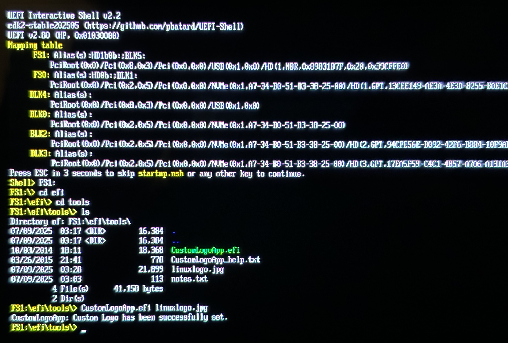

## Customize the UEFI boot logo of your HP laptop

Personally I used this for my HP Zbook Ultra g1a. I really hated that for such an expensive laptop I have to see the stupid "Wolf security" and "Powered by ... experiences" logos, it's really quite embarrassing. Since I am on linux I could not use the [CMSL tools](https://developers.hp.com/hp-client-management/doc/set-hpfirmwarebootlogo) to change my boot logo so I took a risk on the efi tool.

## Usage
1. Copy the contents of the folder USB onto a FAT32 formatted usb drive (the drive should contain the efi folder).
2. Reboot and boot from the usb drive.
3. In the shell we need the usb drive file system, type "FS1:" into the terminal (it could also be "FS0:" etc).
4. Next, go to the directory that contains the tool: "cd efi", "cd tools"
5. Then we can flash the image "CustomLogoApp.efi logo.jpg" (replace with correct filename)
6. Use "exit" and restart, the new logo is now shown.

## Notes
* The image must be a JPG, smaller than 32K, and have a resolution of less than 1024x768.
* The x64 efi shell (shellx64.efi renamed to bootx64.efi) is from here: https://github.com/pbatard/UEFI-Shell/releases
* The custom logo tool is from here: https://support.hp.com/lt-en/drivers/hp-z440-workstation/6978828
* Credit to [Larry Ewing](https://en.wikipedia.org/wiki/Larry_Ewing) for the original [linux logo (edited)](https://brandlogos.net/linux-logo-svg-92851.html)

THESE INSTRUCTIONS AND SOFTWARE ARE PROVIDED “AS IS”, WITHOUT WARRANTY OF ANY KIND, EXPRESS OR IMPLIED, INCLUDING BUT NOT LIMITED TO THE WARRANTIES OF MERCHANTABILITY, FITNESS FOR A PARTICULAR PURPOSE AND NONINFRINGEMENT. IN NO EVENT SHALL THE AUTHORS OR COPYRIGHT HOLDERS BE LIABLE FOR ANY CLAIM, DAMAGES OR OTHER LIABILITY, WHETHER IN AN ACTION OF CONTRACT, TORT OR OTHERWISE, ARISING FROM, OUT OF OR IN CONNECTION WITH THE SOFTWARE OR THE USE OR OTHER DEALINGS IN THE SOFTWARE.
